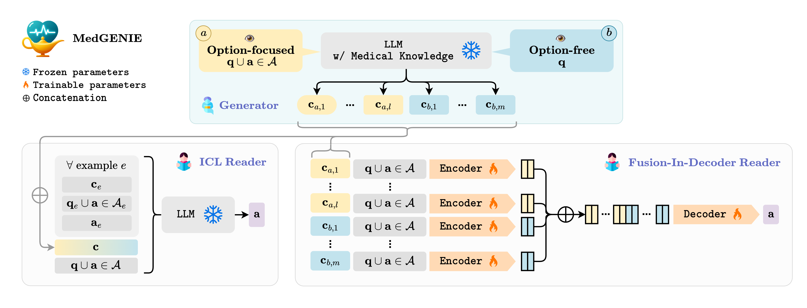

<div align="center"> </div>
<h1 align="center"> MedGENIE </h1>
<h2 align="center"> To Generate or to Retrieve? <br>  On the Effectiveness of Artificial Contexts for Medical Open-Domain Question Answering  </h2>

Official source code of **MedGENIE**, the first generate-then-read framework for multiple-choice question answering in medicine. This method generates relevant information through domain-specific models before answering questions, outperforming traditional retrieval-based approaches. Tested on MedQA-USMLE, MedMCQA, and MMLU datasets within a 24GB VRAM limit, **MedGENIE** sets new benchmarks, proving that generated contexts can significantly enhance accuracy in medical question answering. 



## 📌 Tables Of Contents
- [Models](#-models)
- [Datasets](#-datasets)
- [Quickstart](#-quickstart)
- [Generate Context](#-generate-context)
- [Reader](#-reader)
    - [Input data format](#-input-data-format)
    - [FID](#1-fusion-in-decoder-fid)
    - [ICL](#2-in-context-learning-icl)
- [Main results](#main-accuracy-results)
- [Citation](#-citation)

## 🖇 Models 

|Model|Params|Role|Checkpoint|
|-------|---|---|:---:|
|**MedGENIE-fid-flan-t5-base-medqa**|250M|👁️ FID-Reader|[](https://huggingface.co/disi-unibo-nlp/MedGENIE-fid-flan-t5-base-medqa)|
|**MedGENIE-fid-flan-t5-base-medmcqa**|250M|👁️ FID-Reader|[](https://huggingface.co/disi-unibo-nlp/MedGENIE-fid-flan-t5-base-medmcqa)|
|**LLaMA-2-chat**|7B|👁️ ICL-Reader|[](https://huggingface.co/meta-llama/Llama-2-7b-chat-hf)|
|**Zephyr-β**|7B|👁️ ICL-Reader|[](https://huggingface.co/HuggingFaceH4/zephyr-7b-beta)|
|**PMC-LLaMA** (AWQ)|13B|📝 Context Generator|[](https://huggingface.co/disi-unibo-nlp/pmc-llama-13b-awq)|

## 🖇 Datasets 

|Dataset|N. options|Original|MedGENIE format|
|-------|:---:|:---:|:---:|
|**MedQA**| 4 |[](https://drive.google.com/file/d/1ImYUSLk9JbgHXOemfvyiDiirluZHPeQw/view)|[](https://huggingface.co/datasets/disi-unibo-nlp/medqa-MedGENIE) |
|**MedQA**| 5 |[](https://drive.google.com/file/d/1ImYUSLk9JbgHXOemfvyiDiirluZHPeQw/view)|[](https://huggingface.co/datasets/disi-unibo-nlp/medqa-5-opt-MedGENIE) |
|**MedMCQA**| 4|[](https://huggingface.co/datasets/medmcqa)|[](https://huggingface.co/datasets/disi-unibo-nlp/medmcqa-MedGENIE) |
|**MMLU medical**<sup>*</sup>| 4 |[](https://drive.google.com/file/d/1vKqPWUle-BQlfvETjK3dUp-5BdeCHp3O/view?usp=sharing)|[](https://huggingface.co/datasets/disi-unibo-nlp/mmlu-medical-MedGENIE) |

<sup>*</sup> For the **MMLU medical** dataset, the chosen subjects are: `high_school_biology`, `college_biology`, `college_medicine`, `professional_medicine`, `medical_genetics`, `virology`, `clinical_knowledge`, `nutrition`, `anatomy`. <br>
From: https://huggingface.co/datasets/lukaemon/mmlu

---


## 🚀 Quickstart
Begin by cloning the repository:

```bash
git clone https://github.com/disi-unibo-nlp/medgenie.git
cd medgenie
```

Next, set up a **Docker container** to install the necessary dependencies as follows:
```bash
docker build -t medgenie .
```

Execute the container using `docker run`.
```bash
docker run -v /path_to/medgenie:/medgenie --rm --gpus device=$CUDA_VISIBLE_DEVICES -it medgenie bash
```


## 📝 Generate Context 

Briefly explanation of how to generate contexts, using [`generate_contexts.py`](./context-generation/generate_contexts.py):

* **Model parameters configuration**
```bash
cd context_generation
python3 generate_contexts.py \
    --model_name disi-unibo-nlp/pmc-llama-13b-awq \
    --batch_size 8 \
    --temperature 0.9 \
    --frequency_penalty 1.95 \
    --top_p 1.0 \
    --max_tokens 512 \
    --use_beam_search False \
```

* **Dataset information**
```bash
    --dataset_name medqa \
    --train_set \
    --test_set \
    --data_path_train train.jsonl \
    --data_path_test test.jsonl \
```

* **Number of contexts**
```bash
    --n 2 \
```

* **NOT to include options in the question** (by default, the options are included)
```bash
    --no_options \
```

To obtain a `multi-view` artifical contexts we can first generate a set of contexts conditioned on *question* and *options* (**option-focused**), and then a set of contexts conditioned only on the *question* (**option-free**, with `--no_options`).

## 👁 Reader
Each `reader` is equiped with custom background passages, allowing them to tackle medical questions effectively even without prior knowledge.

### ⚙ Input data format
After the context generation is necessary to concatenate and convert all contexts into a single input file for the readers. <br/> For conversion use [`preprocess.py`](./utils/preprocess.py) as follows:
```bash
cd utils
python3 preprocess.py \
    --dataset_name medqa \
    --test_set \
    --data_path_test path_to_test_set \
    --contexts_w_ops path_to_generated_contexts_w_ops \
    --contexts_no_ops path_to_generated_contexts_no_ops \
    --n_context number_of_total_contexts \
```
Entry example:
```
{
        "id": 0,
        "question": "A junior orthopaedic surgery... Which of the following is the correct next action for the resident to take?\nA. Disclose the error to the patient and put it in the operative report\nB. Tell the attending that he cannot fail to disclose this mistake\nC. Report the physician to the ethics committee\nD. Refuse to dictate the operative report",
        "target": "B",
        "answers": [
            "B"
        ],
        "ctxs": [
            {
                "text": "Inadvertent Cutting of Tendon is a complication, ..."
            },
            {
                "text": "A resident is obligated to be..."
            },
            {
                "text": "This is an example of error in the operative note, ..."
            },
            {
                "text": "Residentserves as the interface between..."
            },
            {
                "text": "As a matter of ethical practice, ..."
            }
        ]
    }
```

### 1. Fusion-In-Decoder (FID)

For the supervised regime, we train a lightweight FID reader [(Izacard and Grave, 2021)](https://aclanthology.org/2021.eacl-main.74).

#### Train
The first step in utilizing FID as a reader is to train the model:
```bash
cd fid_reader
python3 train.py \
    --dataset_name "medqa" \
    --n_options 5 \
    --model_size base \
    --per_gpu_batch_size 1 \
    --accumulation_steps 4 \
    --total_steps number_of_total_steps \
    --name my_test \
```
* **Contexts information**
```bash
    --n_context 5 \
    --text_maxlength 1024 \
```
#### Test
Then, it is possible to evaluate the trained model:
```bash
cd fid_reader
python3 test.py \
    --model_path checkpoint/my_test/checkpoint/best_dev \
    --dataset_name "medqa" \
    --n_options 4 \
    --per_gpu_batch_size 1 \
    --n_context 5 \
```

### 2. In-Context-Learning (ICL)

This strategy consists in feed an **LLM reader** with few-shot open-domain question answering demonstrations and the test query preceded by its artificial context.

```bash
cd icl_reader
python3 benchmark.py \
    --model_name HuggingFaceH4/zephyr-7b-beta \
    --dataset_name medqa \
    --test_set \
    --n_options 4 \
    --batch_size 8 \
    --max_context_window 4000 \
```

* It is possible to specify **whether to use the contexts or not** (by default, contexts are used).
```bash
    --no_contexts \
```
---

## Main accuracy results
| Model | Ground (Source) | MedQA | MedMCQA | MMLU | AVG (&darr;) |
| --- | --- | --- | --- | --- | --- |
| MEDISTRON (7B) | Ø | 52.0 | 59.2 | 55.6 | 55.6 |
| PMC-LLaMA (7B) | Ø | 49.2 | 51.4 | 59.7 | 53.4 |
| LLaMA-2 (7B) | Ø | 49.6 | 54.4 | 56.3 | 53.4 |
| Zephyr-β* (7B) | Ø | 49.3 | 43.4 | 60.7 | 51.1 |
| Mistral-Instruct* (7B) | Ø | 41.1 | 40.2 | 55.8 | 45.7 |
| LLaMA-2-chat* (7B) | Ø | 36.9 | 35.0 | 49.3 | 40.4 |
| Codex* (175B) | Ø | 52.5 | 50.9 | - | - |
| LLaMA-3-Instruct (8B)| Ø | 59.2 | - | 69.0 |
|---|---|---|---|---|---|
| MedGENIE-Zephyr-β* (7B) | G (PMC-LLaMA) | 59.7 | 51.0  | 66.1  | 58.9  |
| MedGENIE-FID-Flan-T5 (250M) | G (PMC-LLaMA) | 53.1 | 52.1 | 59.9 | 55.0 |
| Zephyr-β* (7B) | R (MedWiki) | 50.5 | 47.0 | 66.9 | 54.8 |
| VOD (220M) | R (MedWiki) | 45.8 | 58.3 | 56.8 | 53.6 |
| MedGENIE-LLaMA-2-chat* (7B) | G (PMC-LLaMA) | 52.6 | 44.8  | 58.8 | 52.1  |
| Mistral-Instruct* (7B) | R (MedWiki) | 45.1 | 44.3 | 58.5 | 49.3 |
| LLaMA-2-chat* (7B) | R (MedWiki) | 37.2 | 37.2 | 52.0 | 42.1 |
| LLaMA-3-Instruct (8B)| G (PMC-LLaMA) | 61.7 | - | 67.1 |

*zero/few-shot inference

## RAGAS Evaluation
| Metric | Dataset| N. Samples | Answer | G | R |
| --- | --- | :---: | --- | :---: | :---: |
| Context Precision | MedQA | 150 | positive | 87.9 | 48.6 |
| Context Recall | MedQA | 150 | positive | 93.4 | 76.2 |
| Faithfulness | MedQA | 150 | positive | 59.7 | 23.8 |
| --- | --- | --- | --- | --- | --- |
| Context Precision | MedQA| 50 | negative | 55.3 | 29.5 |
| Context Recall | MedQA | 50 | negative | 59.2 | 32.0 |

## 📚 Citation
If you find this research useful, or if you utilize the code and models presented, please cite:
```bibtex
@misc{frisoni2024generate,
      title={To Generate or to Retrieve? On the Effectiveness of Artificial Contexts for Medical Open-Domain Question Answering}, 
      author={Giacomo Frisoni and Alessio Cocchieri and Alex Presepi and Gianluca Moro and Zaiqiao Meng},
      year={2024},
      eprint={2403.01924},
      archivePrefix={arXiv},
      primaryClass={cs.CL}
}
```


